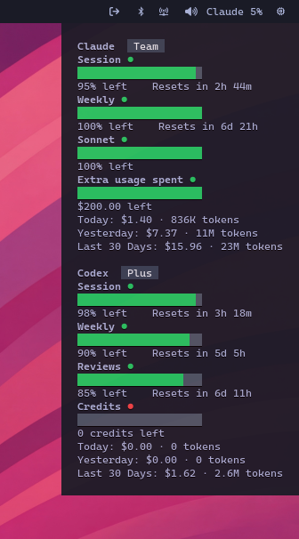

# OpenUsage Waybar — Track AI coding subscription usage from your status bar

A Linux/Wayland status bar module for tracking AI coding subscription usage. Runs as a [Waybar](https://github.com/Alexays/Waybar) custom module, outputting JSON with Pango-formatted tooltips including progress bars.



This project is a Linux-only fork of [openusage](https://github.com/robinebers/openusage), which is a macOS menubar app. It reuses the same JavaScript plugin system, but exposes it as a CLI binary suitable for embedding into Waybar (or any tool that consumes its JSON output).

## Install

```sh
cargo install --git https://github.com/benwyrosdick/openusage --bin openusage-waybar
```

## Set up plugins

```sh
git clone https://github.com/benwyrosdick/openusage /tmp/openusage
mkdir -p ~/.local/share/openusage
cp -r /tmp/openusage/plugins ~/.local/share/openusage/plugins
```

## Add to your Waybar config

In `~/.config/waybar/config.jsonc`:

```jsonc
// Add "custom/openusage" to your modules-right (or modules-left/center)
"modules-right": ["custom/openusage", ...],

"custom/openusage": {
  "exec": "openusage-waybar claude codex",  // plugin IDs to show
  "return-type": "json",
  "interval": 300,
  "format": "{}",
  "tooltip": true,
  "signal": 8  // optional: refresh with pkill -SIGRTMIN+8 waybar
}
```

Run `openusage-waybar --list` to see available plugin IDs. Pass no arguments to run all plugins.

## Environment variables

| Variable                | Description                            |
| ----------------------- | -------------------------------------- |
| `OPENUSAGE_PLUGINS_DIR` | Custom path to plugins directory       |
| `OPENUSAGE_DATA_DIR`    | Custom path to data/cache directory    |
| `RUST_LOG`              | Log level (default: `warn`)            |

## Plugin discovery

`openusage-waybar` looks for plugins in this order:

1. `$OPENUSAGE_PLUGINS_DIR`
2. `~/.local/share/openusage/plugins` (XDG data)
3. `~/.config/openusage/plugins`
4. `./plugins` or `../plugins` (development)

## Supported providers

- [**Amp**](docs/providers/amp.md) — free tier, bonus, credits
- [**Antigravity**](docs/providers/antigravity.md) — all models
- [**Claude**](docs/providers/claude.md) — session, weekly, extra usage, local token usage (ccusage)
- [**Codex**](docs/providers/codex.md) — session, weekly, reviews, credits
- [**Copilot**](docs/providers/copilot.md) — premium, chat, completions
- [**Cursor**](docs/providers/cursor.md) — credits, total usage, auto, API, on-demand, CLI auth
- [**Factory / Droid**](docs/providers/factory.md) — standard, premium tokens
- [**Gemini**](docs/providers/gemini.md) — pro, flash, workspace/free/paid tier
- [**JetBrains AI Assistant**](docs/providers/jetbrains-ai-assistant.md) — quota, remaining
- [**Kimi Code**](docs/providers/kimi.md) — session, weekly
- [**MiniMax**](docs/providers/minimax.md) — coding plan session
- [**Windsurf**](docs/providers/windsurf.md) — prompt credits, flex credits
- [**Z.ai**](docs/providers/zai.md) — session, weekly, web searches

## Build from source

Requires a recent Rust toolchain (stable).

```sh
cargo build --release -p openusage-waybar
# binary: target/release/openusage-waybar
```

### Workspace layout

- `crates/openusage-plugin-engine/` — shared plugin engine (manifest loader, QuickJS runtime, host API)
- `crates/openusage-waybar/` — the Waybar CLI binary
- `plugins/` — bundled JavaScript plugins, one per provider

### Plugin authoring

See [docs/plugins/api.md](docs/plugins/api.md) and [docs/plugins/schema.md](docs/plugins/schema.md).

## Credits

- Originally part of [openusage](https://github.com/robinebers/openusage) by [Robin Ebers](https://github.com/robinebers). The Linux/Waybar support was developed on the `waybar-support` branch and extracted into this standalone project after upstream chose to stay macOS-only.

## License

[MIT](LICENSE)
